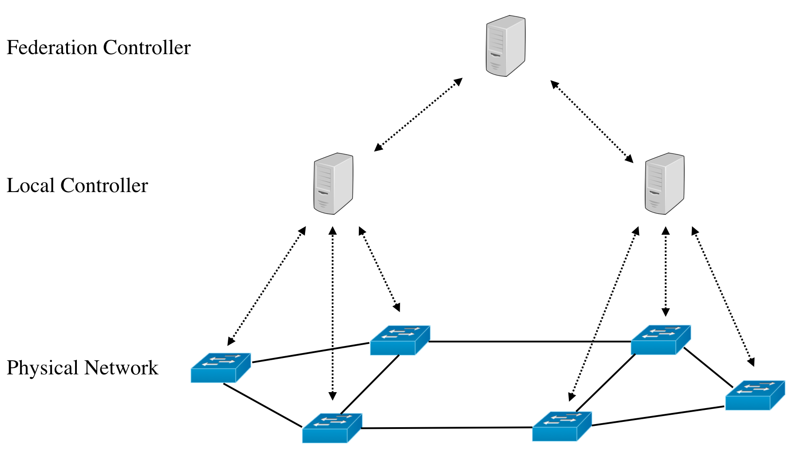

### 研究紹介

篠宮研究室　M2 本間 光宣

---

### 研究の概要

Software Defined Networking (SDN) 環境下におけるトラフィック分散手法の実装

---
### 研究×プログラミング

- トラフィック情報を集め、混雑を検知するアプリケーションの作成
  - 言語：ruby
  - フレームワーク：Ruby on Rails
- 仮想的な実験環境の構築
  - 言語：python
  - 利用しているソフトウェア：mininet
  
---

### おまけ：プログラミングの学習方法

僕の場合のプログラミング学習履歴

---

- 1年
  - 授業でC言語を学ぶ
- 2年
  - 授業でJavaを学ぶ
  - 12月〜：Javaでアルゴリズムを実装
  - 1月〜2月：長期インターンでruby、Ruby on Railsを学ぶ

大学の授業でプログラミングを始める

授業以外では、習ったアルゴリズムを実装してみたりする

---

- 3年
  - 長期インターンでObjective-Cを学ぶ
  - Javaで卒論用のシミュレータを作成
  - 6月：Swiftが発表される、Swiftを学ぶ
  - 10月：Rails チュートリアル
- 4年
  - 5月〜8月：Swiftの勉強
  - 9月：技術ブログの更新を通知するtwitter botの作成・公開

2年の1月から長期インターンを始める

→仕事でプログラミングをしている人達と出会い、自分なりにいろいろ勉強を始めてみる

---
  
- M1
  - 研究のためにJavaでアプリ開発
  - 1月：Scalaの勉強
  - 2月：Goの勉強、dockerの勉強
- M2
  - 5月：MinecraftサーバをAWS上に構築
  - 6月〜8月：Elixierの勉強
  - 9月〜：研究のためにrubyでアプリ開発
  
就活前になって自分が関係ありそうな分野の勉強をし始める
