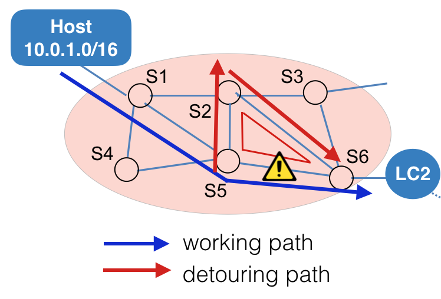

### 研究紹介

篠宮研究室　M2 本間 光宣

---

### 研究の概要

Software Defined Networking (SDN) 環境下におけるトラフィック分散手法の実装

---
### 研究×プログラミング

- トラフィック情報を集め、混雑を検知するアプリケーションの作成
  - 言語：ruby
  - フレームワーク：Ruby on Rails
- 仮想的な実験環境の構築
  - 言語：python
  - 利用しているソフトウェア：mininet
  
---

### おまけ：プログラミングの学習方法

僕の場合のプログラミング学習履歴

---

- 1年
  - 授業でC言語を学ぶ
- 2年
  - 授業でJavaを学ぶ
  - 12月〜：Javaでアルゴリズムを実装
  - 1月〜2月：インターンでruby、Ruby on Railsを学ぶ

大学の授業でプログラミングを始める 
授業以外では、習ったアルゴリズムを実装してみたりする

---

- 3年
  - インターンでObjective-Cを学ぶ
  - Javaで卒論用のシミュレータを作成
  - 6月：Swiftが発表される、Swiftを学ぶ
- 4年
  - 5月〜8月：Swiftの勉強
  - 9月：VPSを借りて遊ぶようになる
  - 9月：技術ブログの更新を通知するtwitter botの作成・公開

インターンで様々なエンジニアと知り合いになり、自分なりにいろいろ勉強を始めてみる 
twitter botを作成・公開する（初めて世に自分のプログラムを公開する）

---
  
- M1
  - 研究のためにJavaでアプリ開発
  - 1月：Scalaの勉強
  - 2月：Goの勉強、dockerの勉強
- M2
  - 5月：MinecraftサーバをAWS上に構築
  - 6月〜8月：Elixierの勉強
  - 9月〜：研究のためにrubyでアプリ開発
  
就活前になって自分が関係ありそうな分野の勉強をし始める 
就活後は将来使いそうな分野の勉強をする

---

### まとめ

- 最初は真似から始める
  - サンプルコードを動かして学ぶ
  - 同じ動作をするように自分で考えて書く
- 慣れてくれば簡単なものから自分で作って公開してみる
- プログラミングはある程度インプットしないとアウトプットできない
  - 本やOSSなどを通して良いコードをたくさん読もう
